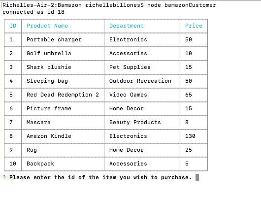
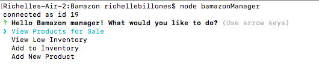
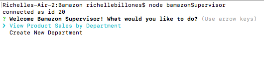

# Bamazon
Bamazon is a command line storefront app that uses MySQL to store and retrieve information. In the app, customers can buy products, managers can view and manipulate inventory, and supervisors can track sales. 

## Getting Started
Clone the repository to a local directory on your computer. To clone the repository, run the following command in your terminal/command prompt:

````
git clone https://github.com/rchlblns/Bamazon.git
````

Change the directory to the project root directory (Bamazon) and install the required npm packages using: 

````
npm install 
````

Then, run command for the mode you want to be on:
* Customer - node bamazonCustomer
* Manager - node bamazonManager
* Supervisor - node bamazonSupervisor

## Modes
**Customer Mode**



The customer page displays a table of available products. The user purchases items by typing in the id of the product they want and the amount they want.

------------------------------
**Manager Mode**



On the manager page, the menu contains for prompts:
* View Products - Displays table of products with expanded infomation, such as stock amounts
* View Low Inventory - Display table of products with low stock
* Add Inventory - Allows the manager to add stock to a product of their choosing
* Add New Product - Allows the manager to add a new product that's available for purchase

------------------------------
**Supervisor Mode**



The supervisor page contains a different menu:
* View Product Sales - Displays a table with overhead costs, product sales, and total profit by department
* Create New Department - Allows the supervisor to add a new department and it's overhead costs

------------------------------

Additonally, all modes contain a second prompt that returns to the main menu or exits the application.

## Built With
* Javascript ES 6
* [Node.js](https://nodejs.org/en/)
* MySQL
* Sequel Pro
 


